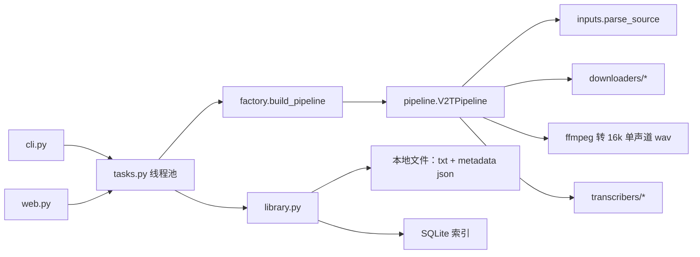

# 架构

## 总览

CLI 优先的 Python 包。CLI、Web 只是外壳，全部通过 `TaskService` 提交任务，由统一的 `V2TPipeline` 执行。Web 由 FastAPI（`/api/*`）和 `web/` 下的 React SPA 组成，FastAPI 直接托管 SPA 的构建产物，只需要一个进程。



## 一次转写的数据流

1. `inputs.parse_source(raw)` 把输入解析为 `SourceRef(kind=bilibili|douyin|video|audio, ...)`。
2. 远程来源（bilibili / douyin）交给 `factory` 按 `kind` 选出的 Downloader。若 `prefer_subtitles`（默认开）先调用 `fetch_subtitles`：拿到平台字幕就跳过下载和 ASR（`transcript_source=subtitle`）；否则 `download` 得到 `DownloadResult(video_path, title, metadata)`，`video_path` 可以是视频也可以是纯音频文件。
3. `pipeline._extract_audio` 用 ffmpeg 转成 16kHz 单声道 wav（本地音频文件跳过这一步）。
4. `Transcriber.transcribe(audio_path, prompt, progress)` 返回 `{"text", "segments", "language", "model", ...}`，其中 `segments` 已归一化为 `[{start, end, text}]`（秒，见 `segments.py`）。
5. pipeline 写出 `transcripts/original/<stem>-<时间>.txt`（纯文本）和 `metadata/<stem>-<时间>.json`（来源、下载信息、`transcript_source`、`segments`）。
6. `library.register_transcript_result` 在 SQLite 里登记 video 和当前转写稿版本。
7. 展示与导出时，`library.load_document(video_id)` 组装 `TranscriptDocument`（元数据 + 当前文本 + segments），交给 `formatters.export_document` 渲染成 txt / plain / md / srt。编辑过的版本不带时间戳。

## 模块职责

| 模块 | 职责 |
| --- | --- |
| `inputs.py` | 输入识别：本地文件后缀、B站 BV / 链接、抖音分享文本与链接 |
| `models.py` | 纯数据类，无业务逻辑；`TranscriptDocument` 是导出和以后 AI 功能的统一输入 |
| `segments.py` | segment 结构与各引擎输出的归一化 |
| `formatters.py` | 纯函数：时间戳格式化、按 30 秒合并段落、txt / md / srt 渲染 |
| `downloaders/` | `Downloader.download(...) -> DownloadResult`；可选 `fetch_subtitles(...) -> SubtitleResult \| None`（B站实现，抖音返回 None） |
| `transcribers/` | `Transcriber.transcribe(audio_path, prompt, progress) -> dict` |
| `factory.py` | 组装 pipeline：provider -> Transcriber（按 provider + model + 配置缓存，模型只加载一次），kind -> Downloader |
| `pipeline.py` | 唯一的流程编排处 |
| `tasks.py` | `ThreadPoolExecutor`（并发数 `V2T_TASK_WORKERS`，默认 1）；把进度快照写库并通知监听者 |
| `progress.py` | 各阶段占总进度的区间：preparing / downloading / extracting_audio / transcribing / writing_outputs / indexing |
| `library.py` | 登记结果、编辑后另存新版本、启动时扫描工作区补索引 |
| `database.py` | SQLite 表结构与查询 |
| `web.py` | FastAPI：`/api/*`（接口见 `docs/api.md`）+ 托管 `web/dist`，非 API 路径回退到 `index.html`；没构建时返回提示页 |
| `web/`（前端） | React SPA：首页（粘贴链接、处理中任务、历史）、任务进度页（1 秒轮询）、文字稿页（时间戳分段、Copy for AI、下载） |
| `user_config.py` / `bootstrap.py` | `config.json` 读写与首次配置向导 |

## 工作区目录

默认 `./.v2t`（可用环境变量 `V2T_HOME` 或 `--workspace` 覆盖）：

```text
.v2t/
  config.json          用户配置（默认 provider/model、云 ASR key）
  app.db               SQLite 索引
  downloads/           下载的视频/音频
  audio/               ffmpeg 输出的 16k wav
  transcripts/original 原始转写稿
  transcripts/edited   Web 上编辑后另存的版本
  metadata/            每次转写的 metadata json（来源、引擎、下载信息、segments）
  exports/             CLI 导出的 txt / md / srt
  browser/             抖音解析用的持久化浏览器目录
```

本地文件是真实数据源，SQLite 只做索引；数据库里存的是相对工作区的路径。

## 数据库表

- `tasks` / `task_progress_events`：任务状态与进度事件
- `videos`：一条转写结果（`source_kind`、来源、标题、引擎、文件路径、当前版本指针）
- `transcript_versions`：`kind=original|edited`，每个版本一个文件
- `categories` / `tags` / `video_tags`：分类与标签

`tasks.kind` 与 `transcript_versions.kind` 是以后扩展"总结 / 分章节"等新任务、新产物的挂载点。

## 配置与环境变量

| 变量 | 作用 |
| --- | --- |
| `V2T_HOME` | 工作区目录 |
| `V2T_LANG` | 界面语言 |
| `V2T_COOKIE_FILE` | B站 cookies.txt 路径（默认 `<工作区>/cookies.txt`） |
| `V2T_USE_PROXY` | B站下载是否走系统代理（默认直连） |
| `V2T_WEB_DIST` | 前端构建产物目录（默认仓库里的 `web/dist`） |
| `V2T_TASK_WORKERS` | 同时执行的任务数（默认 1；只用云 ASR 时可调大） |
| `HF_ENDPOINT` | HuggingFace 镜像，国内下载 faster-whisper 模型用 `https://hf-mirror.com` |
| `V2T_DOUYIN_HEADLESS` | 抖音解析是否用无头浏览器（默认 `1`） |
| `V2T_DOUYIN_BROWSER` | 抖音解析用哪个浏览器：`auto`（默认，先本机 Chrome 再自带 Chromium）/ `chrome` / `chromium` |

平台细节见 `docs/platforms/`。
