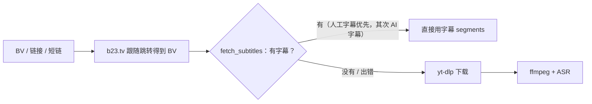

# B站

B站的媒体和字幕都通过 yt-dlp 获取。短链展开、字幕优先和 Cookie 在下载器里完成，机制说明见 `docs/architecture.md` 的「远程媒体怎么拿到」。

## 支持范围

- 输入：BV 号、`bilibili.com/video/BV...` 链接、`b23.tv` 短链、App 里复制的整段分享文本。
- 分 P：链接里的 `?p=N` 只处理第 N P。
- 暂不支持：番剧 / 课程等特殊页面。

## 流程：字幕优先，ASR 兜底

1. `YtDlpDownloader.resolve_source`：`b23.tv` / `bili2233.cn` 短链先跟随跳转，得到带 BV 号的地址（在下载器里做，输入解析阶段不访问网络）。
2. `fetch_subtitles`：`extract_info(download=False, writesubtitles=True)`，按 `zh-CN > zh-Hans > zh > 繁体 > ai-zh > en > ai-en` 选字幕，弹幕（`danmaku`）永远排除。字幕内容解析为 segments（SRT 或 B站 JSON）。
3. 拿到字幕：不下载视频、不跑 ASR，`engine=subtitle`、`model=<字幕语言>`、`transcript_source=subtitle`。前端会显示“平台字幕 / 平台 AI 字幕”。
4. 没有字幕或获取出错：照常下载并做 ASR。

**B站字幕需要登录**：不带 Cookie 时 B站只返回弹幕，会直接回退到 ASR。

## 配置

| 环境变量 / 选项 | 默认 | 作用 |
| --- | --- | --- |
| `V2T_COOKIE_FILE` | `<工作区>/cookies.txt` | Netscape 格式 cookies.txt |
| `V2T_COOKIES_FROM_BROWSER` | 空 | 没有 cookies.txt 时，直接读浏览器登录态，例如 `chrome` / `edge` / `firefox`。macOS 首次读取 Chrome 会弹出钥匙串授权 |
| `V2T_USE_PROXY` | 关 | B站 CDN 经常屏蔽代理节点，默认直连；设为 `1` 走系统代理 |
| `config.json` 的 `prefer_subtitles` | `true` | 是否优先使用平台字幕 |
| CLI `--force-asr` | - | 本次忽略字幕，强制 ASR（评测识别效果时有用） |

## 常见问题

- HTTP 412：B站风控。先升级 yt-dlp（`uv lock --upgrade-package yt-dlp`，再按 `docs/development.md` 的组合 `uv sync`），仍不行就配置 Cookie。
- 有字幕但没用上：确认 Cookie 有效（登录状态），`video2text tx` 输出里会看到“正在检查平台字幕”。
