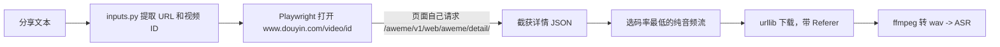

# 抖音

## 支持范围

- 支持：正常公开的视频。输入可以是 App 里复制的整段分享文本，也可以是 `v.douyin.com/xxx` 短链、`www.douyin.com/video/{id}`、`iesdouyin.com/share/video/{id}`、带 `modal_id=` 的链接。
- 不支持：图文作品、私密 / 仅粉丝可见 / 已删除的视频、需要登录才能看的内容。遇到这些情况直接报错。
- 抖音没有可用的平台字幕，一律走 ASR。

## 原理

1. `inputs.py` 从分享文本里提取第一个 URL。能直接拿到视频 ID 时打开 `https://www.douyin.com/video/{id}`，否则（短链）直接打开短链，由浏览器跟随跳转。
2. `downloaders/douyin.py` 的 `fetch_aweme_detail` 用 Playwright 启动浏览器（持久化目录 `<工作区>/browser`），等待页面自己发出的 `/aweme/v1/web/aweme/detail/` 响应，读取 JSON。人机校验和请求签名都由页面自己完成，我们不碰签名算法。
3. `select_audio_urls` 从 `aweme_detail.video.bit_rate_audio[].audio_meta.url_list` 里按码率从低到高取 `main_url` / `backup_url` / `fallback_url`，最后兜底用 `video.play_addr.url_list`（带画面的 mp4，ffmpeg 会丢掉视频流）。
4. 用 urllib 流式下载到 `<工作区>/downloads/douyin-{id}.m4a`，请求头必须带 `Referer: https://www.douyin.com/`（不带会一直挂起）。一个地址失败就换下一个。
5. 元数据：`desc`（去掉 `#话题` 和 `@` 作为标题）、`author.nickname`、`video.duration`（毫秒转秒）、`caption`（作者文案全文，以后可作为 ASR 提示词）。

实测（2026-09）：无头模式 + 本机 Chrome，每条解析约 2 秒，不需要登录；5 分钟视频的音频约 1.7MB，下载不到 1 秒。

## 配置

| 环境变量 | 默认 | 作用 |
| --- | --- | --- |
| `B2T_DOUYIN_HEADLESS` | `1` | 设为 `0` 用有头模式（会弹出浏览器窗口），用于排查人机校验问题 |
| `B2T_DOUYIN_BROWSER` | `auto` | `auto` 先用本机 Chrome，找不到再用 Playwright 自带 Chromium；也可指定 `chrome` / `msedge` / `chromium` |

依赖：`uv sync --extra douyin`。本机没有 Chrome 时再运行 `uv run playwright install chromium`。

同一时间只会有一个浏览器实例（持久化目录不能被多个进程同时打开），并发任务会在解析这一步排队，每条只占几秒。

## 失败模式与排查

| 报错 | 常见原因 | 处理 |
| --- | --- | --- |
| 打开抖音页面超时，没有等到视频详情数据 | 人机校验没过、网络慢、抖音改版不再请求该接口 | 设 `B2T_DOUYIN_HEADLESS=0` 看浏览器里实际显示什么 |
| 抖音视频不可用（filter_reason） | 删除、私密、仅粉丝可见 | 无解，换视频 |
| 这是抖音图文作品 | 图文作品没有口播音频 | 不支持 |
| 抖音详情接口返回 HTTP 403/429 | 触发频率风控 | 等几分钟再试；删除 `<工作区>/browser` 重置浏览器状态 |
| 抖音音频下载失败 | CDN 地址过期或网络问题 | 重试即可（地址每次解析都会刷新） |
| 无法启动浏览器 | 没有 Chrome，也没装 Playwright Chromium | `uv run playwright install chromium` |

## 抖音改版时怎么查

1. 用有头模式或任意浏览器打开视频页，在开发者工具 Network 里搜 `aweme/detail`，确认接口路径是否变化；变了就改 `DETAIL_API_PATH`。
2. 看响应 JSON 里音频地址的位置是否变化，调整 `select_audio_urls`。`tests/test_douyin_downloader.py` 里的 `make_detail` 是按真实结构裁剪的样例，改完同步更新。
3. 如果浏览器方案彻底失效，备选方案见 `docs/decisions.md` 的 D2（引入 jiji262/douyin-downloader 的签名实现）。
